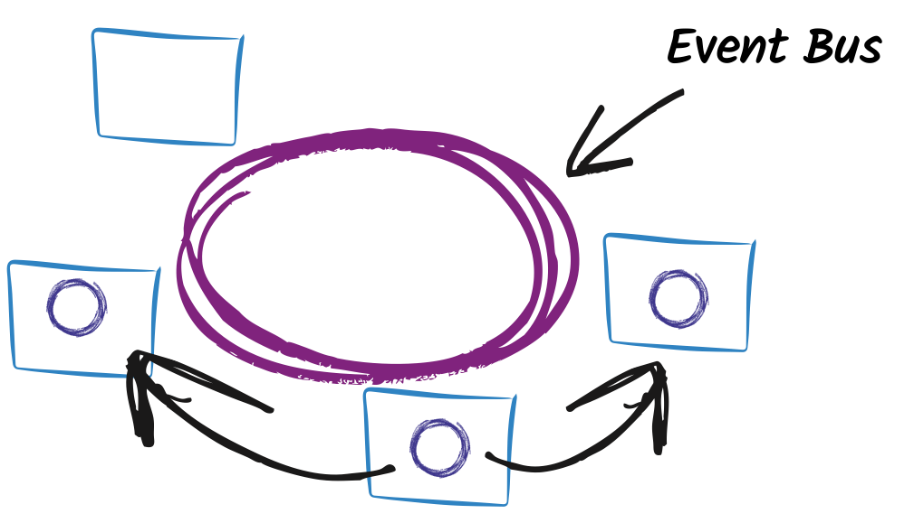
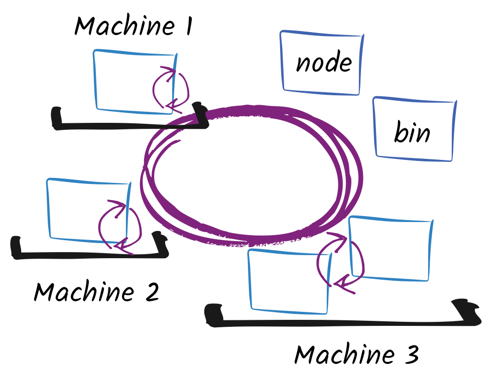

# /dev/070

### Bringing order to the chaos with Eclipse Vert.x

<small>by [Paulo Lopes](https://www.jetdrone.xyz) / [@jetdrone](http://twitter.com/jetdrone)</small>

---

<!-- .slide: style="text-align: left;" -->
## Who am I?

* Principal Software Engineer @RedHat
* Eclipse Vert.x core developer
* Fluent in Java and JavaScript amongst others
* Game developer
* Father of 3

---

## Hands-up time

* Reactive programming  <!-- .element: class="fragment grow" -->
* Reactive systems      <!-- .element: class="fragment grow" -->
* Eclipse Vert.x        <!-- .element: class="fragment grow" -->
* Kubernetes/OpenShift  <!-- .element: class="fragment grow" -->

---

## Vert.x as a Reactive System

<aside class="notes">
  Create the plot for the story, why the audience should move
  from their current stack to Vert.x.
</aside>

---

### Reactive Programming

* Thread oriented apps can't scale  <!-- .element: class="fragment grow" -->
* CPU have bugs and get slower      <!-- .element: class="fragment grow" -->
* Cloud/Containers are the trend    <!-- .element: class="fragment grow" -->
* Billing per usage                 <!-- .element: class="fragment grow" -->

---

### Quick recap on C10K

<aside class="notes">
  The C10k problem was coined in 1999 when Dan Kegel managed to sere 10.000 clients at once over 1 Gigabit Ethernet connection.

  A 1999 CPU compares give or take to a Raspberry Pi. So lets look at a variation of the C10K problem.

  Instead of just concurrent requests lets think of **websockets**. **Websockets** require you to keep
  state and the sockets open all the time.

  For an application server, this means **10K threads**.
</aside>

---

<!-- .slide: data-background-video="images/c10k.webm" -->

---

### But you know Node is reactive!

---

<!-- .slide: data-background="images/node.gif" -->

---

### Reactive Programming

* Node.JS
* Spring 5
* <!-- .element: class="fragment" --> Is just **reactive programming** enough?

---

<!-- .slide: data-background="images/manifesto.jpg" data-background-size="contain" -->

<aside class="notes">
  The Reactive Manifesto is more than just Reactive Programming
</aside>

---

## How does Vert.x work?

* Single thread event loop*   <!-- .element: class="fragment grow" -->
* Simple message bus
* Builtin clustering
* Polyglot

---

<!-- .slide: data-background="images/nostop.gif" data-background-size="contain" -->

<aside class="notes">
  Vert.x eventloop It's not like node...
</aside>

---

<!-- .slide: data-background="images/sync-workers.gif" data-background-size="contain" -->

<aside class="notes">
  Vert.x has an event loop per CPU core!
</aside>

---

## How does Vert.x work?

* Single thread event loop*
* Simple message bus          <!-- .element: class="fragment grow" -->
* Builtin clustering
* Polyglot

---

#### EventBus PTP

<!-- .element: class="stretch" --> 

---

#### EventBus Pub-Sub

<!-- .element: class="stretch" --> 

---

#### EventBus RPC

<!-- .element: class="stretch" --> 

---

## How does Vert.x work?

* Single thread event loop*
* Simple message bus
* Builtin clustering          <!-- .element: class="fragment grow" -->
* Polyglot

---

#### EventBus Cluster

<!-- .element: class="stretch" --> 

---

## How does Vert.x work?

* Single thread event loop*
* Simple message bus
* Builtin clustering
* Polyglot                    <!-- .element: class="fragment grow" -->

---

  # PART II

---

### Imagine...

* We want a Pong As A Service app
* Web Interface
* AI is run on the back-end
* AI is updated ASAP

---

### Vert.x Starter

<a href="http://start.vertx.io/" target="_blank">Vert.x Starter - http://start.vertx.io/</a>

---

### Code Listing #1

```java
// Create a router object.
Router app = Router.router(vertx);

app.get().handler(StaticHandler.create());

// Create the HTTP server and pass the
// "accept" method to the request handler.
vertx
  .createHttpServer()
  .requestHandler(app::accept)
  .listen(
    // Retrieve the port from the configuration,
    // default to 8080.
    config().getInteger("http.port", 8080));
```

---

<!-- .slide: data-background="images/manifesto.jpg" data-background-size="contain" -->

<aside class="notes">
  Quick recap, we want a reactive system, so lets add the AI component
</aside>

---

### Code Listing #2

```java
vertx.eventBus().consumer("paas.ai", msg -> {

  final JsonObject ball = msg.body().getJsonObject("ball");
  final JsonObject paddle = msg.body().getJsonObject("paddle");

  // ... AI Logic...

  final JsonObject response = new JsonObject();

  // ... more verbose java code...

  msg.reply(response);
});
```

---

### Code Listing #3

```js
eventBus.registerHandler("paas.ai", msg => {

  let ball = msg.body.ball;
  let paddle = msg.body.paddle;

  // ... AI Logic...

  let response = { ... };

  // ... more node.js code...

  msg.reply(response);
});
```

---

# DEMO

---

# PART III

---

<!-- .element: class="stretch" --> 

---

### Principles of Chaos Engineering

* Build a Hypothesis around Steady State Behavior <!-- .element: class="fragment grow" -->
* Vary Real-world Events                          <!-- .element: class="fragment grow" -->
* Run Experiments in Production                   <!-- .element: class="fragment grow" -->
* Automate Experiments to Run Continuously        <!-- .element: class="fragment grow" -->
* Minimize Blast Radius                           <!-- .element: class="fragment grow" -->

---

### Going to Production

Well...

---

# DEMO

<aside class="notes">
  Deploy to OpenShift
</aside>

---

### Principles of Chaos Engineering

* Build a Hypothesis around Steady State Behavior
* Vary Real-world Events                          <!-- .element: class="fragment grow" -->
* Run Experiments in Production                   <!-- .element: class="fragment grow" -->
* Automate Experiments to Run Continuously        <!-- .element: class="fragment grow" -->
* Minimize Blast Radius

---

### Tooling

* https://github.com/netflix/chaosmonkey
* <!-- .element: class="fragment grow" --> https://github.com/gaia-adm/pumba
* ...

---

# DEMO

---

<!-- .slide: style="text-align: left;" -->
# Thank you!

* https://www.jetdrone.xyz
* https://twitter.com/jetdrone
* http://vertx.io
* https://www.reactivemanifesto.org
* http://principlesofchaos.org
* https://github.com/dastergon/awesome-chaos-engineering
